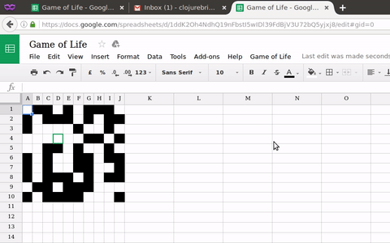

# Game of Life for Google Sheets in ClojureScript

A demo of using ClojureScript with Google sheets, have a look at
[the demo](https://docs.google.com/spreadsheets/d/1ddK2Oh4NdhQ19nFbstI5wIDl39FdBjV3U72bQ5yjxj8/edit#gid=0)
to see it in action.



## Build

```
lein cljsbuild once main
```

## License ##

Copyright © 2016 Arne Brasseur

Distributed under the Mozilla Public License 2.0
